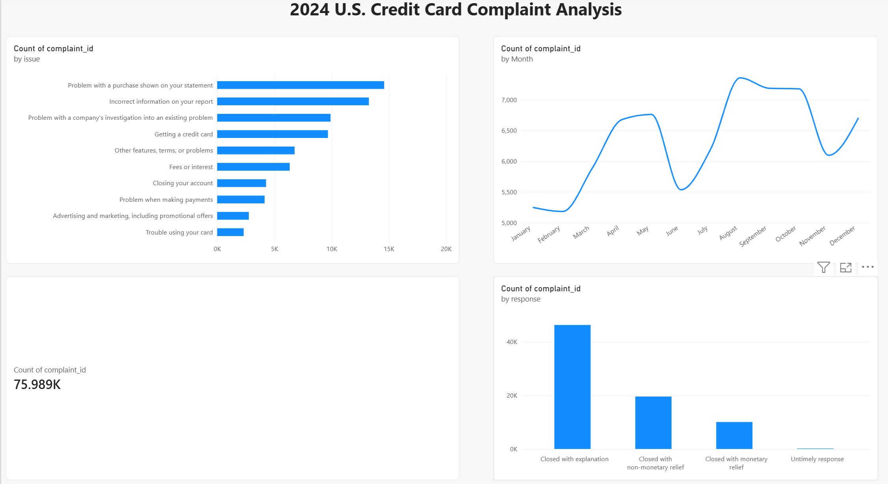

# 2024 U.S. Credit Card Complaint Analysis

I explored published credit card complaints in the Consumer Financial Protection Bureau (CFPB) database to see which issues were most common, how complaint counts changed during 2024, and how companies responded.

## Power BI report

## Tools

- Python, pandas, and Jupyter Notebook for cleaning and exploring the data
- Power BI for visualization

## What I did

I worked with 75,989 credit card complaint records received in 2024. I checked missing values and duplicate complaint IDs in Jupyter. There were no duplicate complaint IDs. I filled 63 missing `sub_issue` values and 213 missing `state` values with `Unknown`, then exported a cleaned CSV for Power BI.

The report shows the total complaints, 10 most common issues, monthly complaint counts, and company response categories.

## Findings

- The most common issue was "Problem with a purchase shown on your statement": 14,595 complaints, or 19.21% of the records.
- August had the most complaints (7,355), while February had the fewest (5,182).
- "Closed with explanation" was the most common company response category.

## Project files

- `notebooks/credit_card_complaints_analysis.ipynb` — cleaning and analysis
- `data/credit_card_complaints_2024.csv` — original extract
- `data/credit_card_complaints_2024_clean.csv` — cleaned data
- `CFPB_Credit_Card_Complaints_2024.pbix` — Power BI report

## Data source

The data is from the [CFPB Consumer Complaint Database](https://www.consumerfinance.gov/data-research/consumer-complaints/). These are counts of published complaints, not rates for all cardholders or proof that a complaint was valid.
